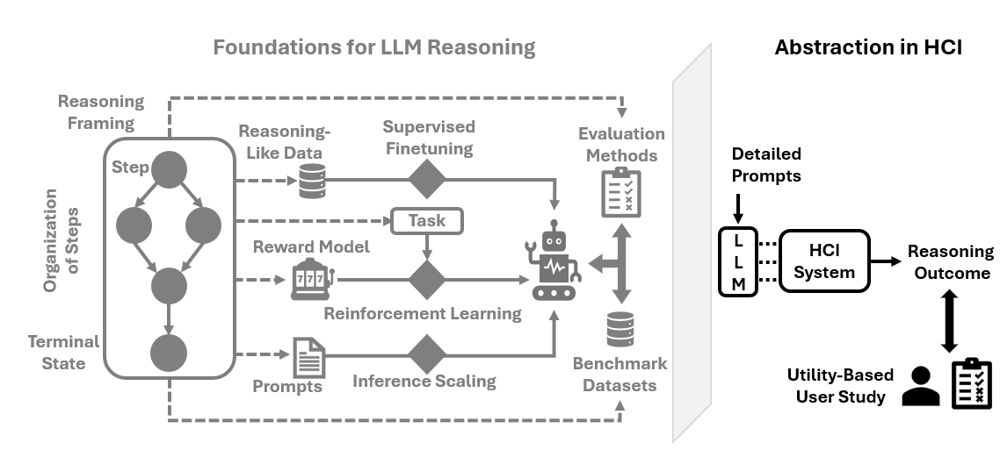

Reasoning About Reasoning (RaR): A Worksheet for Reflective Use of LLM Reasoning in HCI
===============================

|DOI|

**RaR** (**R**\ easoning **a**\ bout **R**\ easoning) is a structured worksheet designed to facilitate critical use of the "reasoning-like" behaviors of Large Language Models (LLMs) in Human-Computer Interaction (HCI).

About
-----

**Context:**
The field of HCI is rapidly adopting LLMs not just as tools, but as foundations for system-building, user proxies, and research assistants. Across these roles, the "reasoning-like" ability of LLMs is often implicitly accepted as a given meta-characteristic with minimal scrutiny. This assumption often leads to the unreflective invocation of LLMs, treating their reasoning capabilities as abstract constants rather than specific, context-dependent variables.

**Approach:**
To encourage critical reflection, we developed a set of questions based on an in-depth literature review of 317 papers from major HCI venues (HCI and CSCW). We frame these questions using `Toulmin’s Layout of Arguments <https://www.semanticscholar.org/paper/The-Uses-of-Argument%2C-Updated-Edition-Toulmin/10b9b37bc77d20c4dac5031ef1fc2425e9c29b1d>`__, a method for analyzing the logic of natural language arguments. This approach moves beyond simple checklists by requiring practitioners to articulate the logical bridges between their evidence and their decisions.

**Outcome:**
We organized these questions into four sections that reflect the iterative phases of engagement with LLMs: Reasoning **Identification**, **Framing**, **Execution**, and **Evaluation**. Each question challenges the abstractions that typically decontextualize the decisions involved in these stages, encouraging a more rigorous examination of *why* and *how* reasoning is being deployed.

How to Use
----------

RaR utilizes **Toulmin’s Argument Model** to deconstruct methodological decisions. Unlike standard documentation, which asks *what* you did, RaR asks you to structure *why* the decision is valid.

Every response to the worksheet questions must address three components:

1.  **Claim:** The specific decision or assertion you are making about the LLM's reasoning (e.g., *"We chose Chain-of-Thought prompting for this task"*).
2.  **Support:** The facts or evidence backing this claim (e.g., *"Paper X shows CoT improves performance on GSM8K benchmarks"*).
3.  **Warrant:** The justifying step—often implicit—that bridges the Support to the Claim (e.g., *"The reasoning required for GSM8K is a valid proxy for the reasoning required in our specific user study"*).

While these cannot be distinctly articulated in many cases, by explicitly thinking about the **Warrant**, RaR helps you identify gaps where "accepted wisdom" regarding LLM reasoning may not actually hold for your specific HCI context.

Resources
---------

* **Worksheet Template:** RaR_Worksheet_Template.rst, RaR_Worksheet_Template.docx
* **Realistic Illustration:** Illustration.rst

Citation
--------

If you use this worksheet in your research, please cite the following paper (under review):

**BibTeX:**

.. code-block:: bibtex

  @article{mothilal2025reasoning,
    title={Reasoning About Reasoning: Towards Informed and Reflective Use of LLM Reasoning in HCI},
    author={Mothilal, Ramaravind Kommiya and Zhang, Sally and Ahmed, Syed Ishtiaque and Guha, Shion},
    journal={arXiv preprint arXiv:2510.22978},
    year={2025}
  }

**Text:**
Mothilal, R. K., Zhang, S., Ahmed, S. I., & Guha, S. (2025). Reasoning About Reasoning: Towards Informed and Reflective Use of LLM Reasoning in HCI. arXiv preprint arXiv:2510.22978.

.. |DOI| image:: https://zenodo.org/badge/DOI/10.5281/zenodo.18651267.svg
   :target: https://doi.org/10.5281/zenodo.18651267
   :alt: DOI
